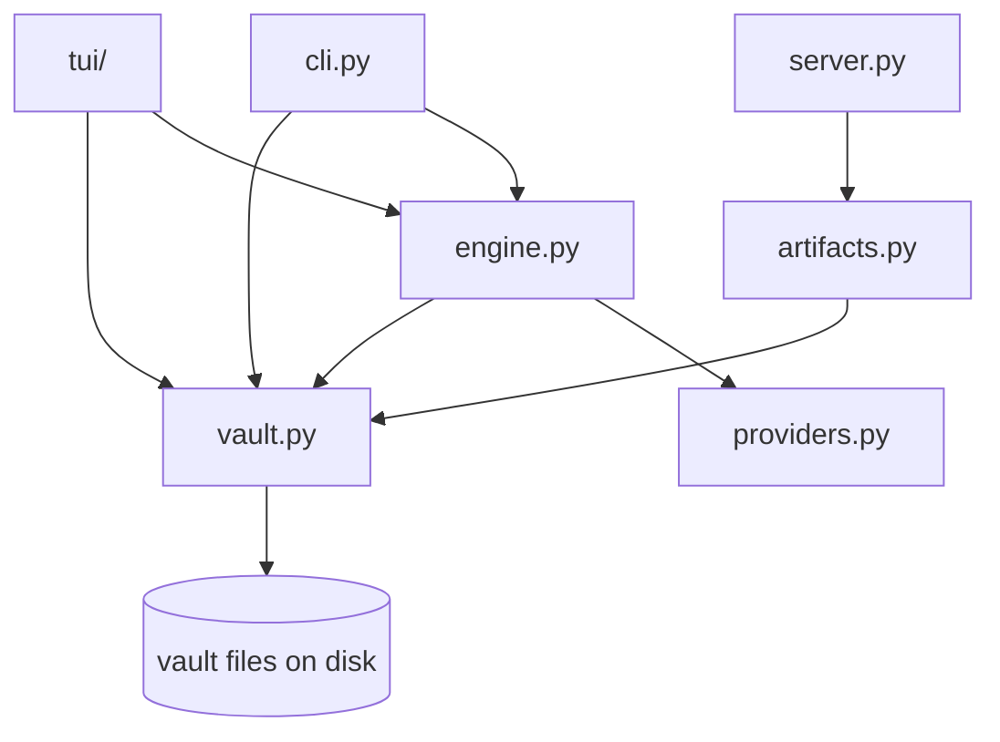

# Architecture

[← Docs index](./README.md)

Pure-Python, standard-library-first. The only runtime dependency is `textual` (for the
TUI); the web server uses `http.server`.

## Modules

| Module | Responsibility |
|---|---|
| `showbible/cli.py` | Argparse command surface and all command handlers; suggestion generation + JSON salvage. |
| `showbible/engine.py` | The six-phase `run_episode` pipeline, phase prompts, transcript attribution, cost recording. |
| `showbible/providers.py` | Provider protocol + `MockProvider`, `LMStudioProvider`, and remote placeholder seams. |
| `showbible/vault.py` | Vault scaffolding, discovery, and all read/write helpers for pack, people, cast, arcs, lore, episodes; `doctor`; atomic writes. |
| `showbible/artifacts.py` | Episode artifact read/write payloads shared by the web UI. |
| `showbible/server.py` | Loopback-only HTTP server and JSON API. |
| `showbible/tui/` | Textual dashboard — `app.py`, `panes/` (episodes, cast, arc, lore, outputs, run detail), `screens/` (add cast/lore/arc-beat, AI suggest, doctor, confirm), `widgets/`, and `runs.py` (concurrent run workers with a progress bridge). |
| `showbible/ui/` | Static HTML for the web UI (packaged as data). |

## Data flow

The vault on disk is the single source of truth. The CLI, TUI, and web UI are all thin
front-ends over the same `vault.py` / `engine.py` helpers:

## Extension points

- **New provider** — implement the `Provider` protocol (`generate(phase, episode_id,
  prompt) -> Generation`) in `providers.py` and add a branch to `resolve_provider()`.
  See [Providers](./providers.md).
- **Pipeline phases** — the phase list and per-phase artifacts live at the top of
  `engine.py` (`PHASES`, `PHASE_ARTIFACTS`). Phase goals/prompts are in
  `LMStudioProvider._user_prompt` and the mock outputs in `MOCK_OUTPUTS`.
- **Vault schema** — read/write helpers and the `doctor` integrity checks live in
  `vault.py`.

## Limitations

This is an early **v0 vertical slice**. Known gaps:

- **Remote providers are stubs.** `anthropic`, `openai`, and `ollama` reach a seam that
  returns placeholder text; only `lmstudio` and `mock` actually generate.
- **Cost tracking is structural only.** Every run records `$0.00`; the ledger plumbing
  exists but no real pricing is wired up.
- **Lore is append-only.** There's no review step separating *proposed* lore from
  *accepted* canon yet.
- **Single-season heuristics.** Episode-id helpers assume `S01Exx` in places.
- `--keep-going` is accepted for forward compatibility but runs synchronously today.
